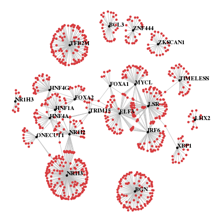
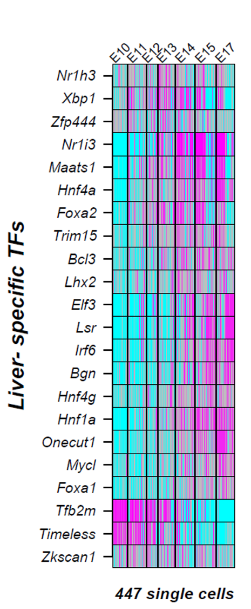
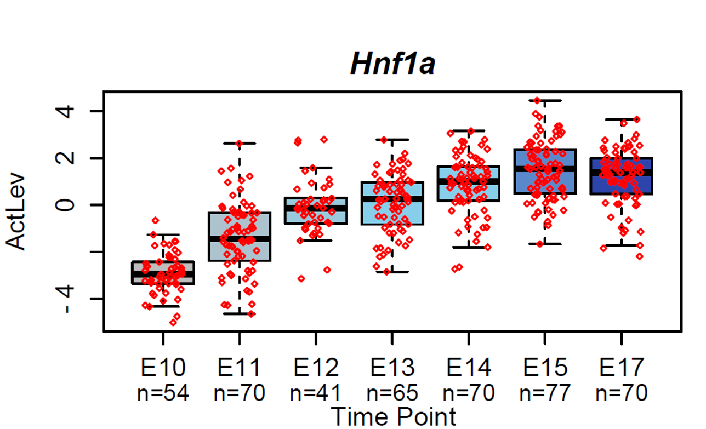

`SCIRA` (Single Cell Inference of Regulatory Activity) is a novel algorithm which can infer regulatory activity in the context of high dropout rate event single cell RNA-seq data. SCIRA is a hybrid approach which uses the inferred predicted targets of a given TF from bulk RNA-seq data to infer its regulatory activity in each single cell. It encompasses two main steps:

1. Construction of a tissue-specific transcription factor regulatory network from bulk RNA-seq data, consisting of transcription factors that are more highly expressed in the user-specified tissue type (the 'tissue type of interest') compared to other tissue types, plus an associated set of high-confidence downstream targets (the "regulon")[@Chen2017]. 
2. Estimation of transcription factor activity at single-cell resolution in any given single cell RNA-seq dataset representative of the same tissue-type. 

To infer the regulatory network, we use the large [GTEx](https://www.gtexportal.org/home/) RNA-seq data set encompassing 8555 samples from about 30 tissue types. The regulatory network is encoded by TF-regulon pairs, and we use the inferred regulons to estimate transcription factor activity single cells using associated scRNA-seq data. Due to the large size of the GTEx data set we did not include it in our package. However, in order to gain an appreciation for the SCIRA algorithm we show the results obtained by applying it to this full dataset. 

### How to use
```{r echo=FALSE}
knitr::opts_chunk$set(fig.pos="h", out.extra='', fig.align="center")
library(SCIRA)
data("GeneExp")
data.m <- GeneExp
dataVAL.m <- GeneExp
data("TFeid")
```

#### Inferring tissue-specific network
```{r warning=F}
net.o <- sciraInfNet(data=data.m, tissue=colnames(data.m), toi = "Lung", cft = c("Blood","Spleen"),
         TFs = TFeid, sdth = 0.25, sigth = 0.05, capth = 0.01, pcorth = 0.2, degth = c(0.05, 0.05),
         lfcth = c(log2(1.5), 0), minNtgts = 5, ncores = 1)
## Note: `data.m` must be an intra-sample log-normalized bulk-tissue mRNA expression (RNA-Seq) dataset, for instance the dataset from GTEX.
## Parameters used here are only used for illustrative purposes, but may not be recommended. See "?sciraInfNet" for more info.
```


#### Estimating transcription factor activity
```{r}
act <- sciraRegAct(data = data.m, regnet = net.o$netTOI, norm = "z", ncores = 1)
```

## Getting started
### Constructing a liver tissue-specific network
`SCIRA` uses a tissue-centric approach, whereby the user specifies a tissue-type of interest, for which `SCIRA` then constructs a corresponding tissue-specific transcription factor regulatory network. We note that this network contains transcription factors that are more active in the tissue of interest, and is unlikely to include those factors which carry out housekeeping functions and which are active in all tissues. The ultimate aim of `SCIRA` is to identify disrupted regulatory networks in diseases or cellular differentiation that occur in that tissue type of interest. For instance, we might be interested in liver differentiation, in which case we would construct a liver-specific regulatory network. As outlined above, there are two main functions in `SCIRA`, the first one being `sciraInfNet()` which generates the regulatory network.

```{r warning=F}
net.o <- sciraInfNet(data=data.m, tissue=colnames(data.m), toi = "Lung", cft = c("Blood","Spleen"),
         TFs = TFeid, sdth = 0.25, sigth = 0.05, capth= 0.01, pcorth = 0.2, degth = c(0.05, 0.05),
         lfcth = c(log2(1.5), 0), minNtgts = 3, ncores = 1)
```

The `sciraInfNet()` function returns an object with all the information of the resulting generated network. Here, we display the network for liver-tissue:

```{r out.width = 450, fig.retina = NULL, echo=F}

```

### Estimating transcription factor activity 
Having inferred the liver-specific regulatory network, we could now infer transcription factor activity in any given single cell sample using the second function `sciraRegAct()`. Users need to provide as input preferably a single cell RNA-seq expression dataset, since we require values for as many of the predicted target genes as possible. For each sample, `sciraRegAct()` regresses the sample's expression profile against the binding profile of the given transcription factor. The t-statistic of this linear regression is interpreted as the transcription factor activity score. After you have run this function, as a sanity check we can display the average TF activity scores out for each tissue-type in the same GTEX dataset.Here taking thr Yang liver differentiation data set[@Yang2017] as an example, with the high-confidence liver-specific regulatory network, transcription factor activities in each single cell samples can be inferred.

```{r}
# estimating transcription factor activity in data.m
TFact <- sciraRegAct(data.m,regnet=net.o$netTOI,norm="z",ncores=1)
## Note: `data.m` here should be a normalized scRNA-seq gene expression data set.
```

```{r out.width = 200, fig.retina = NULL, echo=F}

```

We observed that indeed most of the transcription factors did exhibit increased activation at some stage during lung development. One of the top-ranked transcription factors was Hnf1a, which showed a clear linear increase in activation with developmental stage. P-value is from a linear regression.

```{r out.width = 500, fig.retina = NULL, echo=F}

```


## Session Info

```{r sessionInfo}
sessionInfo()
```

## References

